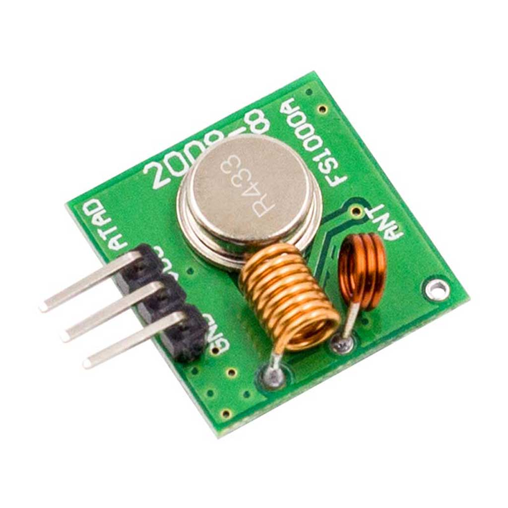
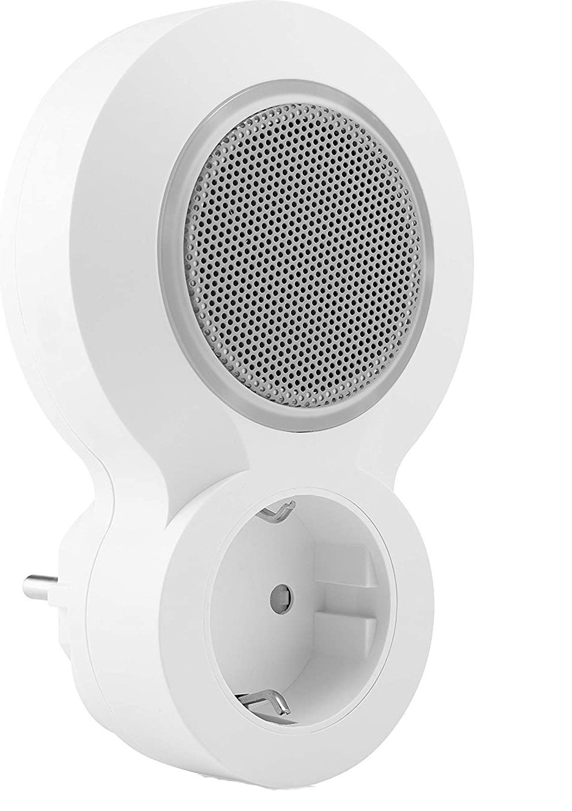
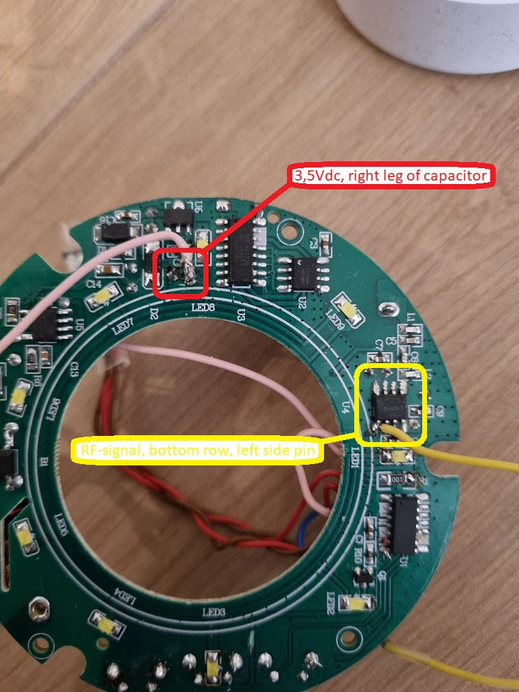
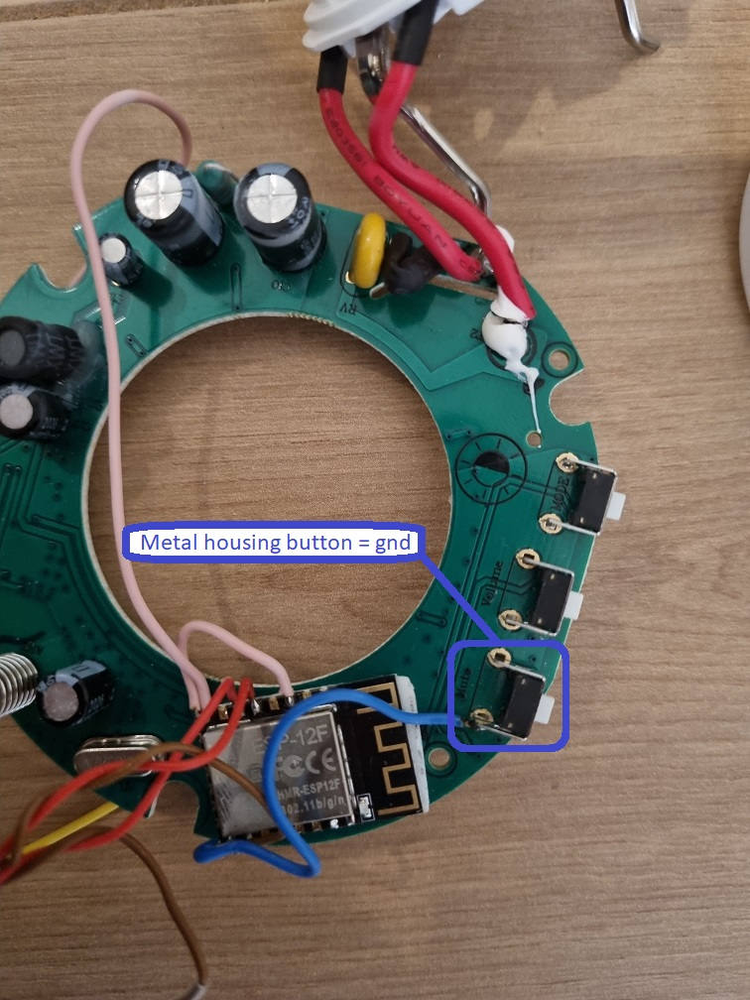

# ESP32-Chime

How to program the ESP, see repository ESP32-Doorbell

The ESP32-chime is made, to send a 433mhz signal or modify a byron 23513 chime to a wifi chime.
Both need to be supported by rcswitch library (https://github.com/sui77/rc-switch).

Sending the command http://ip/ring will trigger the code in the esp32 chime.
This will output the code, which can be send using a 433mhz transmitter, or build in the byron 23513 chime

The 433mhz transmitter which can be used

The Byron 23513 which can be modified (warranty is gone, your own responsibility when doing this)

How to modify Byron 23513, your own responsibility.  
Don't blame if you mess it up.
- Remove the screws on the backside  
- Open carefully the backside, just open a little 
- The powerplug part is held in place with 2 small hooks  
- Carefully open the hooks and take out the powerplug part.  
- Remove the screws, to take out the pcb  
- See the picture, where the 3,5Vdc, RF-signal and GND can be found.

The 3,5Vdc is on the 3,3Vdc pin. It is a little higher, but my ESP can handle it.  
Between the RF-signal and the GPIO i have a photomos relay, this takes out the enable signal of the ESP  
By doing this, you still can use the original push-button, otherwise not  

  

